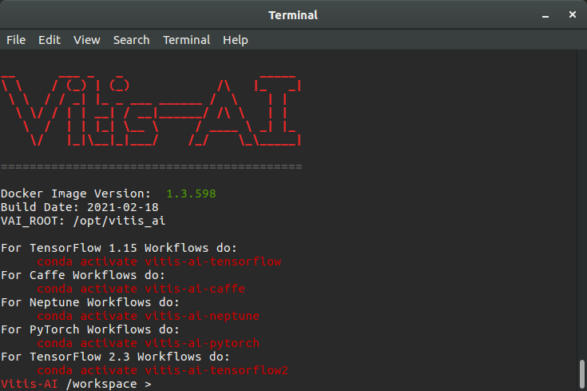

# Setting Up Vitis AI Tools

[Vitis AI repository](https://github.com/Xilinx/Vitis-AI)

## Clone the Vitis AI repository  

To clone the latest release, run the following command in a terminal.  

    git clone --recurse-submodules https://github.com/Xilinx/Vitis-AI

To clone any specific version of the tool, switch to that specific branch and use the following format.

    git clone --recurse-submodules <branch_url>

For example, for version 1.3.2, run

    git clone --recurse-submodules https://github.com/Xilinx/Vitis-AI/tree/1.3.2

You can download from the [releases](https://github.com/Xilinx/Vitis-AI/releases) section too but it is better to clone the repository.

## Setting up Docker on Ubuntu

Uninstall previous versions of Docker with the following command.

    $ sudo apt-get remove docker docker-engine docker.io containerd runc

Use the following commands to set up the repository and install docker.

    $ sudo apt-get update
    $ sudo apt-get install \
        apt-transport-https \
        ca-certificates \
        curl \
        gnupg \
        lsb-release

    $ curl -fsSL https://download.docker.com/linux/ubuntu/gpg | sudo gpg --dearmor -o /usr/share/keyrings/docker-archive-keyring.gpg

    $ echo \
        "deb [arch=amd64 signed-by=/usr/share/keyrings/docker-archive-keyring.gpg] https://download.docker.com/linux/ubuntu \
        $(lsb_release -cs) stable" | sudo tee /etc/apt/sources.list.d/docker.list > /dev/null

    $ sudo apt-get update
    $ sudo apt-get install docker-ce docker-ce-cli containerd.io

To install Docker on other OSes, refer [Install Docker Engine
](https://docs.docker.com/engine/install/).

## Configuring Docker to run without root permissions

The Docker daemon always runs as the `root` user. To run docker without root permissions, create a docker group and add your user to that group.

To create the docker group, run

    $ sudo groupadd docker

To add your user to the docker group, run

    $ sudo usermod -aG docker $USER

Log out and log back in so that your group membership is re-evaluated. On Linux, you can also use the following command.

    $ newgrp docker

To verify your user is in the docker group, run

    $ groups $USER

To verify you can run docker without sudo, run
    
    $ docker run hello-world

This command downloads a test image and runs it in a container. When the container runs, it prints a message and exits.

## Downloading / Building a Docker Image 
There are two ways to setup Vitis AI Tools.  
1. Using the prebuilt Docker containers available at Docker Hub
    > Download the container that matches the version of Vitis AI repository that you cloned previously. The version should at least match the major and minor version number.
    1. For GPU, [xilinx/vitis-ai](https://hub.docker.com/r/xilinx/vitis-ai/tags)
    2. For CPU, [xilinx/vitis-ai-cpu](https://hub.docker.com/r/xilinx/vitis-ai-cpu/tags)

    To download a docker image, use the following command format

        $ docker pull <user/repository:tag>

    For example, to download CPU container with tag 1.3.598, run

        $ docker pull xilinx/vitis-ai-cpu:1.3.598

    To download the latest, run

        $ docker pull xilinx/vitis-ai-cpu:latest

2. Building the containers locally with Docker recipes  
    From where you had cloned the repository, move into `./Vitis-AI/setup/docker`. You will find the CPU (`docker_build_cpu.sh`) and the GPU (`docker_build_gpu.sh`) recipe. Use the GPU recipe if you have a compatible nVidia graphics card with CUDA support; otherwise use the CPU recipe.

    Use the following command for CPU docker.
    
        $ ./docker_build_cpu.sh
    
    Use the following command for GPU docker.
    
        $ ./docker_build_cpu.sh

## Running Vitis AI Tools

Open up a terminal and move to the cloned repository. You will find a shell script named `docker_run.sh`.

Run the following command to list all the available docker images.

    $ docker images

Run the following command to run the Vitis AI Tools.

    $ ./docker_run.sh xilinx/vitis-ai-cpu:1.3.598

